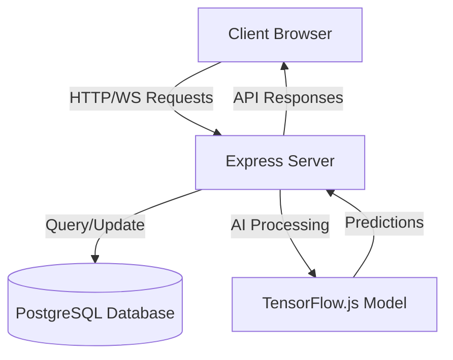
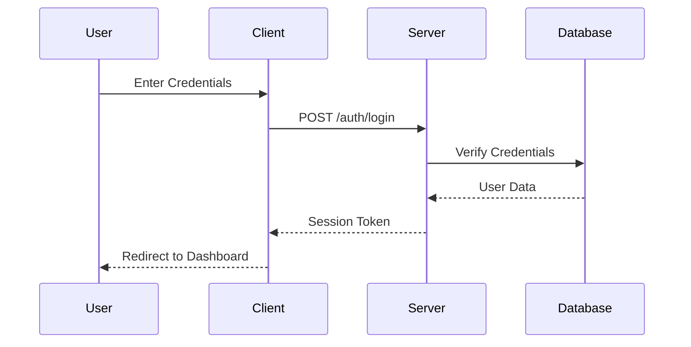
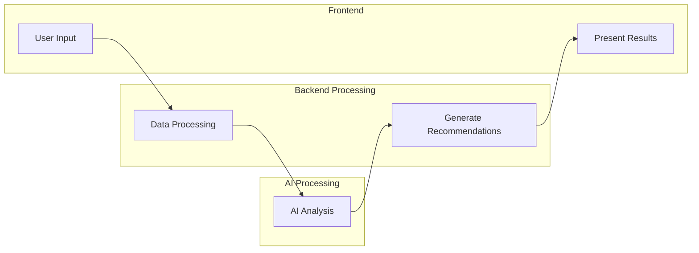
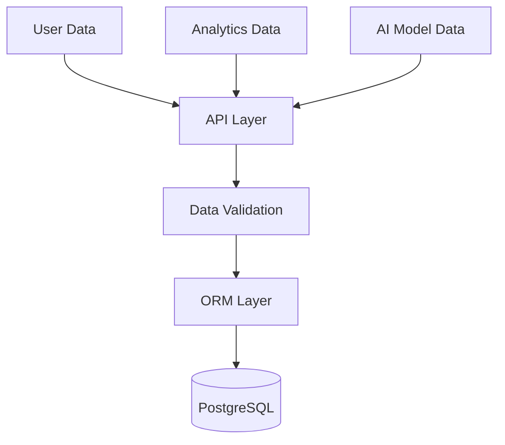
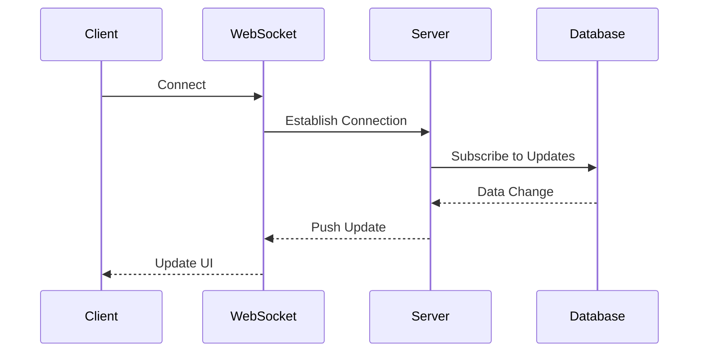
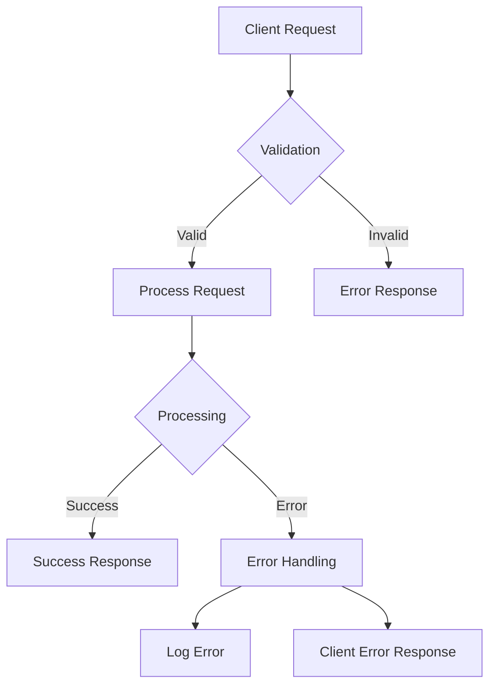

# Data Flow Diagrams

This document outlines the data flow within the Digital Marketing AI Assistant application using Mermaid diagrams.

## System Overview

## Authentication Flow

## Marketing Analysis Flow

## Data Storage Flow

## Real-time Updates Flow

## Error Handling Flow

